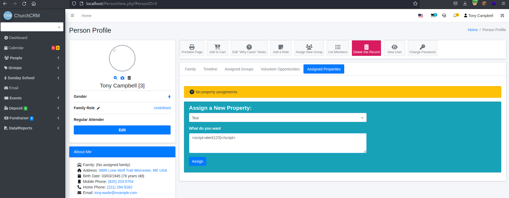

# CVE-2023-38766 - Stored Cross-Site Scripting (XSS) via User Profile Property

## Description
A cross site scripting (XSS) vulnerability in ChurchCRM v5.0.0 allows remote attackers to inject arbitrary web script or HTML via a crafted payload to the PersonView.php endpoint. An authenticated attacker can perform stored XSS by editing their user profile. The payload is placed within the 'What do you want' field within the Assign New Property feature. This payload is triggered whenever anyone, including the admin, views this user's profile. This vulnerability can be used to execute arbitrary JavaScript code within the victim's session, perform information disclosure, or perform other CSRF attacks to potentially hijack the website.

## Proof of Concept
The following XSS payload simply demonstrates an alert: ``. A more complex payload that loads a CSRF script could also be used, such as ``.

1. Navigate to the user’s profile, and then to the Assigned Properties tab.

2. Assign a new property with the XSS payload in the ‘What do you want’ field.

3. The payload will be stored within the user’s profile. It will be triggered immediately, and whenever any user views this user’s profile - including the admin.
